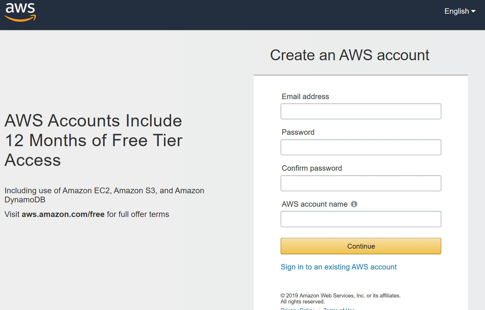

# ServerlessWorkshop - AWS S3 Object Storage

S3 is an AWS service for storing objects, it can be used for storing and serving up files.

It is a backend service but we treat it here as it is a common BaaS (Backend-as-a-Service) which we will use to augment a Serverless application.

You will need to have an AWS account before this step.

You can create an account at https://portal.aws.amazon.com/billing/signup#/start

