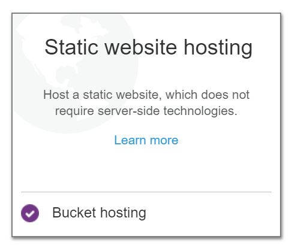

# Creating static web-sites using AWS S3 Object Storage

You should first have
- installed the awscli package to provide the aws command and also
- configured either
  - the ~/.aws/configure file with your AWS account credentials or
  - created a sourceable ~/.aws/credentials.rc (can be in any location) file


```bash
# cat ~/.aws/credentials.rc
```

    
    # user1:
    
    export AWS_ACCESS_KEY_ID="<your-access-key-id>"
    export AWS_SECRET_ACCESS_KEY="<your-secret-access-key-id>"
    export AWS_DEFAULT_REGION=us-west-1
    


If you have chosen to use an rc file, source it as ```source <your-aws-credentials-rc-file>```, e.g.


```bash
. ~/.aws/credentials.rc
```

We can now use the aws cli utility to access S3 commands.

Let's investigate the available commands with ```aws s3 help```


```bash
aws s3 help 
```

    S3()                                                                      S3()
    
    
    
    NAME
           s3 -
    
    DESCRIPTION
           This  section  explains  prominent concepts and notations in the set of
           high-level S3 commands provided.
    
       Path Argument Type
           Whenever using a command, at least one path argument must be specified.
           There are two types of path arguments: LocalPath and S3Uri.
    
           LocalPath: represents the path of a local file or directory.  It can be
           written as an absolute path or relative path.
    
           S3Uri: represents the location of a S3 object, prefix, or bucket.  This
           must  be  written in the form s3://mybucket/mykey where mybucket is the
           specified S3 bucket, mykey is the specified S3 key.  The path  argument
           must  begin with s3:// in order to denote that the path argument refers
           to a S3 object. Note that prefixes are separated  by  forward  slashes.
           For  example, if the S3 object myobject had the prefix myprefix, the S3
           key would be myprefix/myobject, and if the object  was  in  the  bucket
           mybucket, the S3Uri would be s3://mybucket/myprefix/myobject.
    
       Order of Path Arguments
           Every  command  takes  one or two positional path arguments.  The first
           path argument represents the source, which is the local  file/directory
           or  S3  object/prefix/bucket  that  is being referenced.  If there is a
           second path argument, it represents the destination, which is the local
           file/directory  or  S3  object/prefix/bucket that is being operated on.
           Commands with only one path argument do not have a destination  because
           the operation is being performed only on the source.
    
       Single Local File and S3 Object Operations
           Some  commands  perform operations only on single files and S3 objects.
           The following commands are single file/object operations if no --recur-
           sive flag is provided.
    
              o cp
    
              o mv
    
              o rm
    
           For  this  type of operation, the first path argument, the source, must
           exist and be a local file or S3 object.  The second path argument,  the
           destination,  can  be  the  name  of  a local file, local directory, S3
           object, S3 prefix, or S3 bucket.
    
           The destination is indicated as a local directory,  S3  prefix,  or  S3
           bucket if it ends with a forward slash or back slash.  The use of slash
           depends on the path argument type.  If the path argument  is  a  Local-
           Path,  the type of slash is the separator used by the operating system.
           If the path is a S3Uri, the forward slash must always be  used.   If  a
           slash  is at the end of the destination, the destination file or object
           will adopt the name of the source file or object.  Otherwise, if  there
           is no slash at the end, the file or object will be saved under the name
           provided.  See examples in cp and mv to illustrate this description.
    
       Directory and S3 Prefix Operations
           Some commands only perform operations on the contents of a local direc-
           tory  or  S3 prefix/bucket.  Adding or omitting a forward slash or back
           slash to the end of any path argument, depending on its type, does  not
           affect  the  results  of  the  operation.   The following commands will
           always result in a directory or S3 prefix/bucket operation:
    
           o sync
    
           o mb
    
           o rb
    
           o ls
    
       Use of Exclude and Include Filters
           Currently, there is no support for the use of UNIX style wildcards in a
           command's  path  arguments.   However,  most  commands  have  --exclude
           "<value>" and --include  "<value>"  parameters  that  can  achieve  the
           desired  result.   These  parameters perform pattern matching to either
           exclude or include a particular file or object.  The following  pattern
           symbols are supported.
    
              o *: Matches everything
    
              o ?: Matches any single character
    
              o [sequence]: Matches any character in sequence
    
              o [!sequence]: Matches any character not in sequence
    
           Any  number of these parameters can be passed to a command.  You can do
           this by providing an --exclude or --include  argument  multiple  times,
           e.g.   --include  "*.txt"  --include  "*.png".  When there are multiple
           filters, the rule is the filters that appear later in the command  take
           precedence  over filters that appear earlier in the command.  For exam-
           ple, if the filter parameters passed to the command were
    
              --exclude "*" --include "*.txt"
    
           All files will be excluded from the command  except  for  files  ending
           with  .txt   However, if the order of the filter parameters was changed
           to
    
              --include "*.txt" --exclude "*"
    
           All files will be excluded from the command.
    
           Each filter is evaluated against the source directory.  If  the  source
           location is a file instead of a directory, the directory containing the
           file is used as the source directory.  For example, suppose you had the
           following directory structure:
    
              /tmp/foo/
                .git/
                |---config
                |---description
                foo.txt
                bar.txt
                baz.jpg
    
           In  the  command aws s3 sync /tmp/foo s3://bucket/ the source directory
           is /tmp/foo.  Any include/exclude filters will be  evaluated  with  the
           source  directory prepended.  Below are several examples to demonstrate
           this.
    
           Given the directory structure above and the command aws s3 cp  /tmp/foo
           s3://bucket/  --recursive --exclude ".git/*", the files .git/config and
           .git/description will be excluded from the files to upload because  the
           exclude  filter  .git/*  will  have the source prepended to the filter.
           This means that:
    
              /tmp/foo/.git/* -> /tmp/foo/.git/config       (matches, should exclude)
              /tmp/foo/.git/* -> /tmp/foo/.git/description  (matches, should exclude)
              /tmp/foo/.git/* -> /tmp/foo/foo.txt  (does not match, should include)
              /tmp/foo/.git/* -> /tmp/foo/bar.txt  (does not match, should include)
              /tmp/foo/.git/* -> /tmp/foo/baz.jpg  (does not match, should include)
    
           The command aws s3  cp  /tmp/foo/  s3://bucket/  --recursive  --exclude
           "ba*" will exclude /tmp/foo/bar.txt and /tmp/foo/baz.jpg:
    
              /tmp/foo/ba* -> /tmp/foo/.git/config      (does not match, should include)
              /tmp/foo/ba* -> /tmp/foo/.git/description (does not match, should include)
              /tmp/foo/ba* -> /tmp/foo/foo.txt          (does not match, should include)
              /tmp/foo/ba* -> /tmp/foo/bar.txt  (matches, should exclude)
              /tmp/foo/ba* -> /tmp/foo/baz.jpg  (matches, should exclude)
    
           Note that, by default, all files are included.  This means that provid-
           ing only an --include filter will not  change  what  files  are  trans-
           ferred.   --include  will only re-include files that have been excluded
           from an --exclude filter.  If you only want to upload files with a par-
           ticular extension, you need to first exclude all files, then re-include
           the files with the particular extension.  This command will upload only
           files ending with .jpg:
    
              aws s3 cp /tmp/foo/ s3://bucket/ --recursive --exclude "*" --include "*.jpg"
    
           If  you wanted to include both .jpg files as well as .txt files you can
           run:
    
              aws s3 cp /tmp/foo/ s3://bucket/ --recursive \
                  --exclude "*" --include "*.jpg" --include "*.txt"
    
           See 'aws help' for descriptions of global parameters.
    
    SYNOPSIS
              aws s3 <Command> [<Arg> ...]
    
    OPTIONS
           None
    
           See 'aws help' for descriptions of global parameters.
    
    AVAILABLE COMMANDS
           o cp
    
           o ls
    
           o mb
    
           o mv
    
           o presign
    
           o rb
    
           o rm
    
           o sync
    
           o website
    
    
    
                                                                              S3()


S3 is organized into buckets, each of which contains a hierarchy of named objects.

The bucket name itself must be globally **unique** - across all AWS accounts not just yours.

Let's see if we have any buckets of our own using the ```aws s3 ls``` command.
You won't have any buckets if you just created your account.


```bash
aws s3 ls
```

Let's create our own bucket, we use the 'mb' or *make bucket* command to do this as
    ```aws s3 mb s3://<my-bucket-name>```
    
Note that we always address buckets in URL form ```s3://<bucket>```


```bash
aws s3 mb s3://mybucket
```

    make_bucket failed: s3://mybucket An error occurred (BucketAlreadyExists) when calling the CreateBucket operation: The requested bucket name is not available. The bucket namespace is shared by all users of the system. Please select a different name and try again.


Of course someone got there first with our "mybucket" name !

So create a unique name, e.g. for myself:


```bash
aws s3 mb s3://mjbright-static-site
```

    make_bucket: mjbright-static-site


```bash
aws s3 ls
```

    2019-01-23 19:38:50 mjbright-static-site


That was lucky !

Now let's add some files to our bucket.

We can do this with the cp or sync commands.

Let's create an HTML index file and copy this into our bucket.


```bash
mkdir website;

cat > website/index.html <<EOF
<html>
<body>
    <h1> My first amazing web site !! </h1>
</body>
</html>
EOF

ls -al website/index.html
```

    -rw-rw-r-- 1 user1 user1 74 Jan 23 19:53 website/index.html


```bash
aws s3 sync ./website s3://mjbright-static-site
```

    upload: website/index.html to s3://mjbright-static-site/index.html


```bash
aws s3 ls s3://mjbright-static-site
```

    2019-01-23 19:54:13         74 index.html


So it seems we have created a static web site.

We can use the handy S3 command website to declare that this is a website.


```bash
aws s3 website s3://mjbright-static-site --index-document index.html
```

The site should be available at http://<bucketname>.s3-website-<region>.amazonaws.com, which in this case would be:
    
    http://mjbright-static-site.s3-website-us-west-1.amazonaws.com/
    
However, if we visit that web page we will get an error telling us that we cannot access the page


```bash
wget -O - http://mjbright-static-site.s3-website-us-west-1.amazonaws.com/index.html
```

    --2019-01-23 20:10:57--  http://mjbright-static-site.s3-website-us-west-1.amazonaws.com/index.html
    Resolving mjbright-static-site.s3-website-us-west-1.amazonaws.com (mjbright-static-site.s3-website-us-west-1.amazonaws.com)... 52.219.28.23
    Connecting to mjbright-static-site.s3-website-us-west-1.amazonaws.com (mjbright-static-site.s3-website-us-west-1.amazonaws.com)|52.219.28.23|:80... connected.
    HTTP request sent, awaiting response... 403 Forbidden
    2019-01-23 20:10:57 ERROR 403: Forbidden.
    


In fact we first need to enable website hosting from the bucket **and** enable public access to the index.html file.

We can do this via the AWS Console.

Connect to the console with your credentials and then navigate to https://s3.console.aws.amazon.com/s3/buckets/.


You should see your bucket listed here.

Click on the line (not on the bucket name which is a link, but under the Access or Region column) to see the following dropdown menu


Click on "Enable Web hosting" and you should see:

<!--  -->



But we still cannot access our site as we need to enable public access to the index.html file.

Click on the bucket name to be taken to a list of files in the bucket, select the index.html file and then "*Make Public*" in the dropdown "*Actions*" menu:


You now should be able to access your site using a browser, or from the command-line:


```bash
wget -q -O - http://mjbright-static-site.s3-website-us-west-1.amazonaws.com/index.html
```

    <html>
    <body>
        <h1> My first amazing web site !! </h1>
    </body>
    </html>


Let's now create something a little more like a website.

We'll use the Pelican command (installed as a Python module).


```bash
pelican -o PELICAN -q

cp -a PELICAN/* website/

aws s3 sync website/ s3://mjbright-static-site/
```

    Done: Processed 0 articles, 0 drafts, 0 pages and 0 hidden pages in 0.07 seconds.
    upload: website/archives.html to s3://mjbright-static-site/archives.html              
    upload: website/images/BucketProperties-BeforeWebHostingEnabled.JPG to s3://mjbright-static-site/images/BucketProperties-BeforeWebHostingEnabled.JPG
    upload: website/categories.html to s3://mjbright-static-site/categories.html
    upload: website/authors.html to s3://mjbright-static-site/authors.html
    upload: website/feeds/all.atom.xml to s3://mjbright-static-site/feeds/all.atom.xml
    upload: website/tags.html to s3://mjbright-static-site/tags.html  
    upload: website/images/BucketProperties.JPG to s3://mjbright-static-site/images/BucketProperties.JPG
    upload: website/index.html to s3://mjbright-static-site/index.html
    upload: website/images/BucketProperties-Settings-EnableWebsiteHosting.JPG to s3://mjbright-static-site/images/BucketProperties-Settings-EnableWebsiteHosting.JPG
    upload: website/images/Make_index_public.JPG to s3://mjbright-static-site/images/Make_index_public.JPG
    upload: website/images/BucketProperties-Settings-Enabled_WebsiteHosting.JPG to s3://mjbright-static-site/images/BucketProperties-Settings-Enabled_WebsiteHosting.JPG


```bash
wget -q -O - http://mjbright-static-site.s3-website-us-west-1.amazonaws.com/index.html
```


Unfortunately this broke our website as we have not yet set permissions for the new files we just added to our website.

Go back to the bucket list at  https://s3.console.aws.amazon.com/s3/buckets/, drill down into your website bucket.

Then select all items within the bucket and from the Access drop-down menu select "*Make Public*"

Your website should now be accessible


```bash
wget -q -O - http://mjbright-static-site.s3-website-us-west-1.amazonaws.com/index.html
```

    <!DOCTYPE html>
    <html lang="en">
    <head>
            <title>A Pelican Blog</title>
            <meta charset="utf-8" />
            <link href="/feeds/all.atom.xml" type="application/atom+xml" rel="alternate" title="A Pelican Blog Full Atom Feed" />
    </head>
    
    <body id="index" class="home">
            <header id="banner" class="body">
                    <h1><a href="/">A Pelican Blog <strong></strong></a></h1>
            </header><!-- /#banner -->
            <nav id="menu"><ul>
            </ul></nav><!-- /#menu -->
    <section id="content">
    <h2>All articles</h2>
    
    <ol id="post-list">
    </ol><!-- /#posts-list -->
    </section><!-- /#content -->
            <footer id="contentinfo" class="body">
                    <address id="about" class="vcard body">
                    Proudly powered by <a href="http://getpelican.com/">Pelican</a>,
                    which takes great advantage of <a href="http://python.org">Python</a>.
                    </address><!-- /#about -->
            </footer><!-- /#contentinfo -->
    </body>
    </html>

You can find more details about S3 website hosting here: https://docs.aws.amazon.com/AmazonS3/latest/dev/WebsiteHosting.html

# Cleanup

Note that we can use the ```aws s3 rm``` command to remove files from the bucket and ```aws s3 rb``` command to remove a bucket.


```bash
aws s3 rm s3://mjbright-static-site --recursive
aws s3 rb s3://mjbright-static-site
```

    remove_bucket: mjbright-static-site

