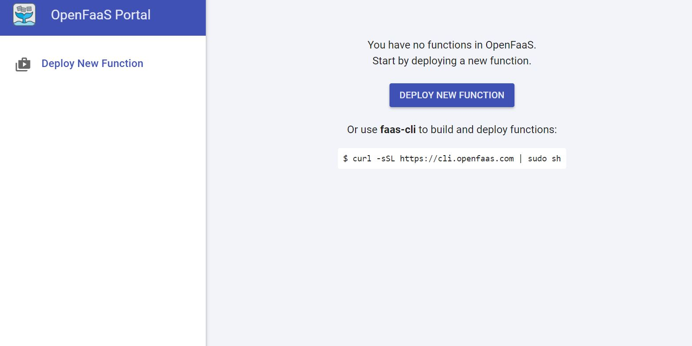

# Serverless Workshop - OpenFaaS


## Installing OpenFaaS

The OpenFaaS **source code repository** at https://github.com/openfaas/faas has already been cloned in your VM at ~/src/git/openfaas/faas.

The **faas-cli** command-line client has already been downloaded from https://github.com/openfaas/faas-cli/releases and place in /usr/local/bin.

Docker has already be installed within the VM.

Verify that docker is installed and available to your user using the ```docker version``` command, you should see something similar to
```
> docker version
Client:
 Version:           18.09.1
 API version:       1.39
 Go version:        go1.10.6
 Git commit:        4c52b90
 Built:             Wed Jan  9 19:35:31 2019
 OS/Arch:           linux/amd64
 Experimental:      false

Server: Docker Engine - Community
 Engine:
  Version:          18.09.1
  API version:      1.39 (minimum version 1.12)
  Go version:       go1.10.6
  Git commit:       4c52b90
  Built:            Wed Jan  9 19:02:44 2019
  OS/Arch:          linux/amd64
  Experimental:     false
```

### Enabling the Swarm cluster

We need to enable Swarm mode, by performing ```docker swarm init```, you should see output similar to
```
> docker swarm init
Swarm initialized: current node (g4wrzwsej0gmkou7iqf4asqrt) is now a manager.

To add a worker to this swarm, run the following command:

    docker swarm join --token SWMTKN-1-0urdp54xbjqt72jeuj9amet9ci4ketyntmx2l6a4qsbvg3g9yl-avy6vll481mozpzdgbi4xxbf4 172.31.21.116:2377

To add a manager to this swarm, run 'docker swarm join-token manager' and follow the instructions.
```

There are no other nodes to add to the swarm.

We can verify that we are in swarm mode with the ```docker node ls``` command, you should see output like
```
> docker node ls
ID                            HOSTNAME            STATUS              AVAILABILITY        MANAGER STATUS      ENGINE VERSION
g4wrzwsej0gmkou7iqf4asqrt *   ip-172-31-21-116    Ready               Active              Leader              18.09.1
```

### Starting OpenFaaS

Now it is sufficient to run the ```deploy_stack.sh``` script, you should see output similar to
```
user1@ip-172-31-21-116 ~/src/git/openfaas.faas> ./deploy_stack.sh
Attempting to create credentials for gateway..
fruu7z64jvkymnidv5bb85ith
w8eyz6n1z4vo9xvcg4i5mgi30
[Credentials]
 username: admin
 password: 1548be044d6ac4741abdc3ed2139f63321d4b7954a1397e0f9f082c860bac480
 echo -n 1548be044d6ac4741abdc3ed2139f63321d4b7954a1397e0f9f082c860bac480 | faas-cli login --username=admin --password-stdin

Enabling basic authentication for gateway..

Deploying OpenFaaS core services
Creating network func_functions
Creating config func_alertmanager_config
Creating config func_prometheus_config
Creating config func_prometheus_rules
Creating service func_nats
Creating service func_queue-worker
Creating service func_prometheus
Creating service func_alertmanager
Creating service func_gateway
Creating service func_faas-swarm
```

Note that an admin password has been auto-generated for you, in the above example it is *1548be044d6ac4741abdc3ed2139f63321d4b7954a1397e0f9f082c860bac480*.

You must **save away** the password to be able to login to the OpenFaaS portal.

You should now be able to login to the OpenFaaS portal.

Obtain the public_ip address of the VM (the same which is present in the ssh_nodeX_user1.sh script) using the provided (in ~/.bash_profile) function public_ip, e.g.
```
user1@ip-172-31-21-116 ~/src/git/openfaas.faas> public_ip
54.67.51.193
```

Connect to the OpenFaaS portal at (**replacing with your ip address**):

 [http://54.67.51.193:8080/](http://54.67.51.193:8080/)
    

You will be prompted to login.

Login with user name '*admin*' and the password which you saved earlier - you did save it didn't you?

You should now see the OpenFaaS portal as below




```bash

```


```bash

```


```bash

```
