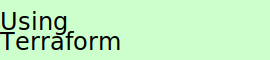

# Welcome to the "*Hands-on with Serverless*" Workshop, 26th Jan, DevConf.cz.

In this workshop we will explore the concept of *Serverless* looking at several Serverless platforms, including
- AWS Lambda,
- OpenFaaS
- and *possibly* Apache OpenWhisk.

The workshop is hands-on and so you will be provided with pre-configured VMs with the necessary tools pre-installed.

Although slides will not be shown, there is an associated slide-set, a general presentation on Serverless at [https://mjbright.github.io/Talks/#201901_devconfcz_2019_1](https://mjbright.github.io/Talks/#201901_devconfcz_2019_1).

## Pre-requisites
You will need a PC or Mac to be able to access the VMs to run the lab (browser + ssh access).
Your instructor will provide you with credentials to connect to your VM once you have entered your e-mail details in the **sign up form** at [**http://bit.ly/20190126SIGNUP**](http://bit.ly/20190126SIGNUP) on the "**USER Registration**" tab.
(if using Google Sheets is a problem, then just pop by to tell me your e-mail).

You may also run the workshop completely on your own PC though there is some tooling to install - described in the setup pages at 
[https://github.com/ServerlessLabs/ServerlessWorkshop/tree/2019-Jan-DevConf.cz/SETUP](https://github.com/ServerlessLabs/ServerlessWorkshop/tree/2019-Jan-DevConf.cz/SETUP).

You will be required to use your own AWS account, all usage will fall within the "Free Tier" usage.

**NOTE**: The Provided VMs will be deleted at the end of the Workshop.

## Agenda
- This Overview, and presentation of Serverless concept
- [Setup for AWS](/SETUP/SETUP-AWS.md)
- [AWS S3 Object Store](AWS-S3-Lambda/README-S3.md) (or minio) for static site hosting
- [AWS Lambda](AWS-S3-Lambda/README-Lambda.md)
  - About AWS Lambda
  - Implementing a REST api
  - Sending SMS or E-Mail
  - Responding to S3 file upload
  - Webhooks
- Scenario Ideas
  - Auto-mailer
  - Aggregator
  - Image processor: colorizer, thumbnail generator
  - OCR/Machine Learning
  - URL Shortener
  - Collaborative Booksmarks site
- [OpenFaaS](OpenFaaS/README.md)
  - About Apache OpenFaaS
  [Setup for OpenFaaS](/SETUP/SETUP-OPENFAAS.md)
  
- [Apache OpenWhisk](Apache-OpenFaaS/README.md)
  - About Apache OpenWhisk
  [Setup for OpenWhisk](/SETUP/SETUP-OPENWHISK.md)

## Learning Paths

See below for a matrix of elements in this tutorial.

It is suggested that you follow one of these paths.

If time allows it is recommended that you first follow one path, then follow the others building upon the knowledge gained in the other paths.

#### Legend

Strong colors: Tutorial elements

Weak colors: Suggested optional elements

Other: Not yet implemented

### Path1: S3, Lambda+Python

<table> <tbody> <tr>
  <th></th>  <th></th>  <th></th>  <th></th>  <th></th>  <th></th>
</tr>
<tr>
  <td></td>  <td></td>  <td></td>  <td></td>  <td></td>  <td></td>
</tr>
<tr>
  <td></td>  <td></td>  <td></td>  <td></td>  <td></td>  <td></td>
</tr>
<tr>
  <td></td>  <td></td>  <td></td>  <td></td>  <td></td>  <td></td>
</tr>
<tr>
  <td></td>  <td></td>  <td></td>  <td></td>  <td></td>  <td></td>
</tr>
<tr>
  <td></td>  <td></td>  <td></td>  <td></td>  <td></td>  <td></td>
</tr>
<tr>
  <td></td>  <td></td>  <td></td>  <td></td>  <td></td>  <td></td>
</tr>
<tr>
  <td></td>  <td></td>  <td></td>  <td></td>  <td></td>  <td></td>
</tr>
 </tbody> </table>

### Path2: S3, Lambda+Node.js

<table> <tbody> <tr>
  <th></th>  <th></th>  <th></th>  <th></th>  <th></th>  <th></th>
</tr>
<tr>
  <td></td>  <td></td>  <td></td>  <td></td>  <td></td>  <td></td>
</tr>
<tr>
  <td></td>  <td></td>  <td></td>  <td></td>  <td></td>  <td></td>
</tr>
<tr>
  <td></td>  <td></td>  <td></td>  <td></td>  <td></td>  <td></td>
</tr>
<tr>
  <td></td>  <td></td>  <td></td>  <td></td>  <td></td>  <td></td>
</tr>
<tr>
  <td></td>  <td></td>  <td></td>  <td></td>  <td></td>  <td></td>
</tr>
<tr>
  <td></td>  <td></td>  <td></td>  <td></td>  <td></td>  <td></td>
</tr>
<tr>
  <td></td>  <td></td>  <td></td>  <td></td>  <td></td>  <td></td>
</tr>
 </tbody> </table>

### Path3: OpenFaaS

<table> <tbody> <tr>
  <th></th>  <th></th>  <th></th>  <th></th>  <th></th>  <th></th>
</tr>
<tr>
  <td></td>  <td></td>  <td></td>  <td></td>  <td></td>  <td></td>
</tr>
<tr>
  <td></td>  <td></td>  <td></td>  <td></td>  <td></td>  <td></td>
</tr>
<tr>
  <td></td>  <td></td>  <td></td>  <td></td>  <td></td>  <td></td>
</tr>
<tr>
  <td></td>  <td></td>  <td></td>  <td></td>  <td></td>  <td></td>
</tr>
<tr>
  <td></td>  <td></td>  <td></td>  <td></td>  <td></td>  <td></td>
</tr>
<tr>
  <td></td>  <td></td>  <td></td>  <td></td>  <td></td>  <td></td>
</tr>
<tr>
  <td></td>  <td></td>  <td></td>  <td></td>  <td></td>  <td></td>
</tr>
 </tbody> </table>

### Path3: OpenWhisk

## Serverless

## Resources

